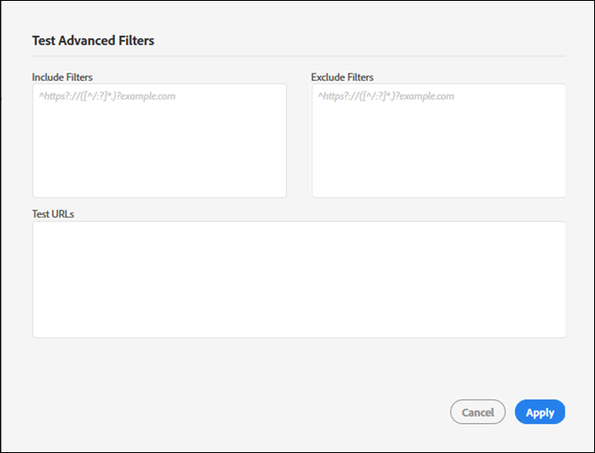

# Crear una nueva auditoría {#create-a-new-audit}

>[!NOTE]
>
>Los usuarios están limitados a realizar una auditoría a la vez. Si intenta iniciar una auditoría con la misma configuración que la que se está ejecutando, se produce un error. Puede utilizar el enlace del mensaje de error si desea cancelar la auditoría que se está realizando para crear una nueva.

Si lo desea, utilice el enlace de la parte inferior de la página para acceder a una cuenta de prueba gratuita con todas las funciones con ObservePoint.

1. En la lista Auditor, haga clic en **[!UICONTROL New Audit]**.

   Se abre la pantalla [!DNL New Audit].

   

1. (Obligatorio) Nombrar la auditoría.

   El nombre puede contener hasta 250 caracteres.
1. (Obligatorio) Especifique la dirección URL de inicio.

   Es necesario el protocolo cuando se especifica la dirección URL inicial. La dirección URL de inicio es la página donde la auditoría empieza a rastrear. Una vez iniciada, Adobe Experience Platform Auditor rastrea hasta 500 páginas, siguiendo los enlaces que empiezan en la dirección URL de inicio. Para obtener más información, consulte [Filtros de inclusión y exclusión](../create-audit/filters.md). La URL de inicio puede contener hasta 250 caracteres.

   >[!NOTE]
   >
   >En algunos casos, para finalizar un análisis de 500 páginas es posible que se necesiten hasta 48 horas.

1. Especifique una o varias direcciones de correo electrónico para las notificaciones referentes a esta auditoría.

   Puede especificar varias direcciones de correo electrónico separadas con comas. El solicitante recibe una notificación de forma predeterminada. Las direcciones de correo electrónico se validan en tiempo real. Si introduce una dirección no válida, se muestra en la pantalla.

   Cada correo electrónico está limitado a un máximo de 250 caracteres, incluido el final de dominio (por ejemplo, .com).

1. Especifique los [!UICONTROL filtros de inclusión].

   Este campo puede contener direcciones URL exactas, direcciones URL parciales o expresiones regulares. Utilice este campo para especificar los criterios que quiere que tengan todas las direcciones URL. Las direcciones URL rastreadas que no coinciden con los criterios de los [!UICONTROL filtros de inclusión] no se incluyen en los resultados de la auditoría.

   Puede introducir los directorios que quiere que analice la auditoría. También puede realizar una auditoría de varios dominios o de referencia automática, dónde debe iniciar la auditoría en un dominio y finalizarla en otro. Para ello, escriba los dominios que quiere recorrer; para patrones de URL complejos, utilice una expresión regular.

   >[!NOTE]
   >
   >Si incluye una página en los filtros que no está conectada a la dirección URL de inicio, o Platform Auditor explora 500 páginas antes de llegar a esa página, la página no se analiza y no se incluye en los resultados de la prueba.

   Los filtros de inclusión tienen un límite de 1000 caracteres por línea.

   Para obtener más información, consulte [Lista de inclusión](../create-audit/filters.md).
1. Especifique los filtros de exclusión.

   La [!UICONTROL lista de exclusión] evita que se auditen las direcciones URL. Utilice direcciones URL exactas, direcciones URL parciales o expresiones regulares, tal y como haría en la [!UICONTROL lista de inclusión].

   Si la auditoría tiene una sesión de usuario, suele excluirse un enlace de cierre de sesión (por ejemplo: `/logout`, es decir, cualquier dirección URL que contenga la cadena `/logout`).

   Los filtros de exclusión tienen un límite de 1000 caracteres por línea.

   Para obtener más información, consulte [Lista de exclusión](../create-audit/filters.md).
1. (Opcional) Si lo desea, puede probar los filtros de inclusión y exclusión y comprobar las direcciones URL.

   Introduzca los filtros y las direcciones URL y haga clic en **[!UICONTROL Apply]** para realizar la prueba.

   

1. Haga clic en **[!UICONTROL Run Report]**.
