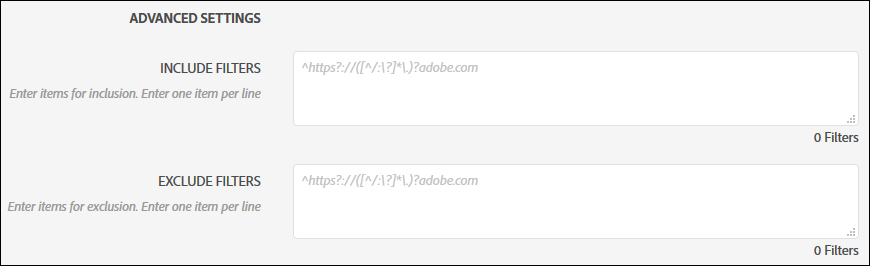
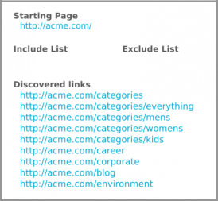
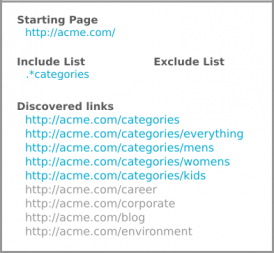
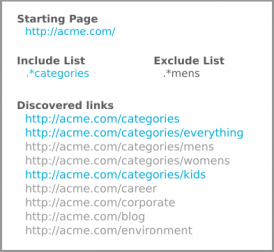
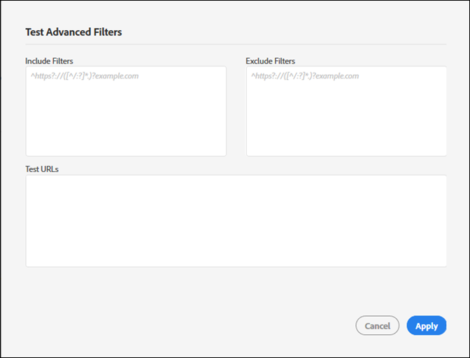

# Incluir y Excluir filtros{#include-and-exclude-filters}

Los filtros de inclusión limitan los enlaces que puede rastrear una auditoría desde la URL de inicio. Los filtros de exclusión impiden que una auditoría rastree los vínculos.

<!--
Content from ObservePoint (https://help.observepoint.com/articles/2872121-include-and-exclude-filters) with their permission. Modified slightly for style and Auditor emphasis.
-->

Los filtros de inclusión y exclusión proporcionan directrices para las auditorías. Si se dejan vacíos los filtros de inclusión y exclusión, una auditoría puede rastrear cualquier vínculo que se encuentre, empezando con los enlaces de la dirección URL de inicio.



Si se aplican filtros de inclusión, filtros de exclusión o una combinación de ambos, se ofrecen instrucciones sobre los enlaces que puede rastrear una auditoría.

Cualquier elemento del [!UICONTROL filtro de inclusión] limita la exploración únicamente a las páginas que coincidan con ese elemento. Cualquier elemento del [!UICONTROL filtro de exclusión] evita que se digitalice cualquier página que coincida con ese elemento.

Los filtros de inclusión y exclusión pueden ser direcciones URL completas, direcciones URL parciales o expresiones regulares que coincidan con una página válida.

## Orden de precedencia {#section-e9d42419dd3f459bb20e7a33c6104f12}

1. **La dirección URL de inicio** tiene prioridad sobre el resto y siempre se visita durante una auditoría, incluso si una dirección URL coincide con un elemento de los filtros de exclusión. La dirección URL de inicio siempre se visita antes que cualquier otra dirección URL.

   

   En la imagen anterior, una auditoría detecta los enlaces de la propiedad de la página `document.links` de inicio. Estos enlaces pueden analizarse en la auditoría.

1. **Las direcciones URL de inclusión** deben enlazarse desde una página de inicio. De lo contrario, no se pueden descubrir ni visitarse.

   

   En la imagen anterior, añadir un filtro de inclusión limita las direcciones URL aptas que coinciden con el filtro. Ahora, la auditoría solo puede analizar cinco enlaces.

1. **Excluir direcciones URL** elimina los enlaces de los requisitos.

   

   En la imagen anterior, añadir un filtro de exclusión evita las direcciones URL de los vínculos aptos. Ahora, la auditoría solo puede analizar tres vínculos.

## Dirección URL de inicio {#section-ccb46abcd96f4a8ab171245015d2b724}

Adobe Experience Platform Auditor necesita una sola página para la dirección URL de inicio. La dirección URL de inicio siempre se visita antes que cualquier otra dirección URL. Los vínculos descubiertos desde la página de inicio pueden visitarse, según los filtros de inclusión y exclusión. Si un elemento de exclusión coincide con una dirección URL de inicio, se omitirá.

## Filtros de inclusión {#section-7626060a56a24b658f8c05f031ac3f5f}

Los filtros de inclusión limitan los vínculos que pueden analizarse durante una auditoría. Los filtros de inclusión pueden ser:

* Direcciones URL completas
* URL parciales
* Expresiones regulares que coinciden con direcciones URL completas o parciales
* Cualquier combinación de lo anterior

Añadir direcciones URL o expresiones regulares al filtro Incluir no garantiza que esas direcciones URL específicas se analicen en la auditoría. La auditoría revisa los enlaces en la dirección URL de inicio y navega por los enlaces aptos. La auditoría sigue este proceso de revisión y navegación hasta alcanzar el límite de 500 direcciones URL escaneadas o hasta que no se encuentren más vínculos aptos.

>[!NOTE]
>
>En algunos casos, para finalizar un análisis de 500 páginas es posible que se necesiten hasta 48 horas.

Por defecto, una auditoría analiza todos los subdominios de la dirección URL inicial. A menos que se sobrescriba explícitamente al proporcionar un filtro Incluir, la exploración utilizará el siguiente filtro de inclusión con expresiones regulares:

`^https?://([^/:\?]*\.)?mysite.com`

Esto permite que pueda visitarse cualquier vínculo encontrado en la página de la URL de inicio. Coincide con cualquier página de cualquier subdominio desde la dirección URL de inicio.

El uso del filtro de inclusión predeterminado ofrece un intervalo amplio para que la auditoría rastree. Para acceder a ciertas secciones o páginas, dé instrucciones específicas para la auditoría añadiendo filtros en este cuadro. En ese caso, reemplace el valor predeterminado por los directorios que desea que analice la auditoría. También puede utilizar filtros de inclusión para realizar auditorías entre dominios donde quiera iniciar la auditoría en un dominio y finalizarla en otro. Para ello, escriba los dominios que desea recorrer. En cualquier caso, para encontrar cualquier URL del filtro de inclusión, deben descubrirse en una página auditada.

Los filtros de inclusión pueden contener direcciones URL exactas, direcciones URL parciales o expresiones regulares. Por ejemplo, si la dirección URL inicial es [!DNL http://mysite.com], las siguientes páginas pueden explorarse por defecto (observe los caracteres en negrita):

```html
http://mysite.com
http
<b>s</b>://mysite.com
http://
<b>www</b>.mysite.com/home
http://
<b>dev</b>.mysite.com/home
http://
<b>my</b>.mysite.com/products/products_and_services.html
```

Para patrones de URL complejos, utilice el [comprobador de expresiones regulares de ObservePoint](https://regex.observepoint.com/).

## Filtros de exclusión {#section-00aa5e10c878473b91ba0844bebe7ca9}

Los filtros de exclusión impiden que se auditen las direcciones URL. Puede utilizar direcciones URL exactas, direcciones URL parciales o expresiones regulares. No se visita ninguna dirección URL que coincida con un elemento de los filtros de exclusión. Si la URL de inicio se incluye en los filtros de exclusión, no se excluye. Una auditoría siempre analiza la dirección URL de inicio.

## Prueba de filtros y direcciones URL {#section-3cfa125b1756411395a64701e128efa0}

Puede probar los filtros y las direcciones URL en Platform Auditor.

Durante la creación de la auditoría, haga clic en **[!UICONTROL Test Advanced Filters]**. Introduzca los filtros y las direcciones URL y haga clic en **[!UICONTROL Apply]**.



## Documentación de ObservePoint {#section-79cdc8e850d047969b6d2badf6bbd6f9}

Este artículo se ha elaborado con la colaboración de ObservePoint. Para disponer de la última información, consulte la [documentación de ObservePoint](https://help.observepoint.com/).
