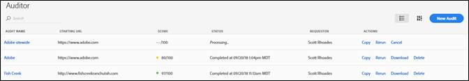
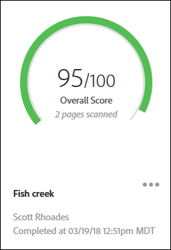
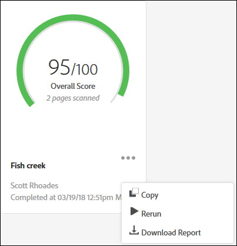

# Página Lista de auditoría{#audit-list-page}

La página Lista de auditoría muestra información sobre todas las auditorías.

Cuando se inicia Adobe Experience Platform Auditor, se muestra la página Lista de auditoría. Puede ver la página Lista de auditoría como una lista o una vista de tarjeta.

## Vista de lista {#section-a428749d2ab94a08bf460e6a486b844a}

La vista de lista muestra la siguiente información para cada una de las auditorías.

| Elemento | Descripción |
|---|---|
| Nombre de auditoría | Nombre proporcionado a la auditoría |
| Dirección URL de inicio | Dirección URL donde la auditoría empieza a rastrear las páginas |
| Puntuación | Las auditorías se clasifican entre 1 y 100, donde 100 indica que no hay problemas en las páginas digitalizadas |
| Estado | Muestra cuándo ha finalizado la auditoría o si se está procesando |
| Solicitante | Muestra el nombre del usuario que ha creado la auditoría |
| Acciones | Incluye enlaces para copiar o volver a realizar la auditoría, cancelar una auditoría que se esté realizando, descargar un informe como hoja de cálculo de [!DNL Excel] o eliminar la auditoría |

Para ver los resultados de la auditoría, haga clic en el nombre de la auditoría.

## Vista de tarjeta {#section-6826b585e53a46daa722b9bd3eda926e}

La vista de tarjeta muestra cada auditoría en formato gráfico.

Para ver los resultados de la auditoría, haga clic en el nombre de la auditoría. Haga clic en el menú situado al lado del nombre para ver los vínculos para copiar, volver a realizar, cancelar la auditoría o descargar un informe como hoja de cálculo de [!DNL Excel] o PDF.

