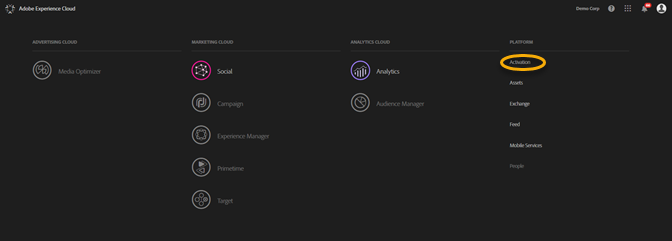
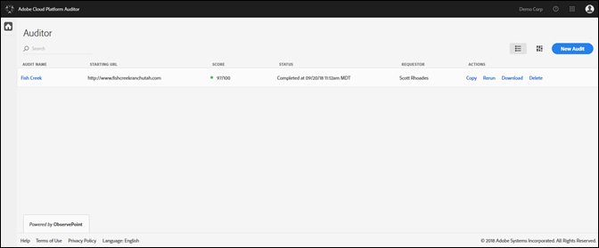
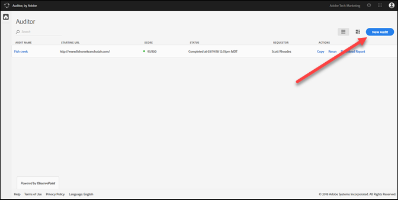
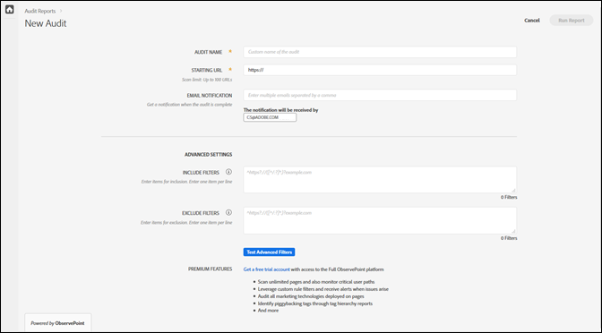
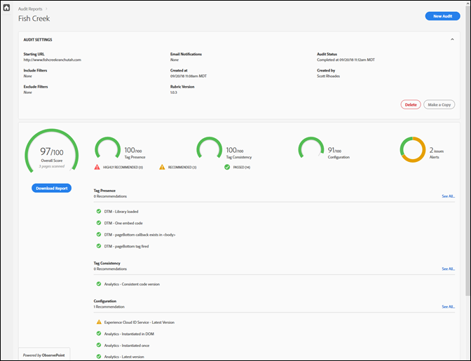

# Primeros pasos {#getting-started}

## Primeros pasos {#task-1024e94b5948413295c9698e62165a04}

<!--
This page is a placeholder for now, we need things like prerequisites, any planning that should be done before using Auditor, initial setup info--that kind of thing.
-->

La primera vez que utilice [!DNL Adobe Experience Platform Auditor], debe rellenar y aceptar el acuerdo de [!DNL Platform Auditor]. [!DNL Platform Auditor] es una solución desarrollada conjuntamente entre [!DNL Adobe] y [!DNL ObservePoint]. Los usuarios de Platform Auditor pueden utilizar la funcionalidad de ObservePoint limitada gratuitamente. Para utilizar Platform Auditor, debe registrarse en las comunicaciones de ObservePoint.

## Realización del primer análisis {#task-b211597afed343cfa238443fcf7c6041}

1. Haga clic en el botón de menú en la esquina superior derecha de la barra de navegación de Adobe Experience Cloud y haga clic en **[!UICONTROL Activation]**.

   

1. Seleccione **[!UICONTROL Auditor]** y acepte las Condiciones de uso.

   La página de Platform Auditor le ofrece un tablero de análisis anteriores, junto con la opción de realizar un nuevo análisis.

   

1. Haga clic en **[!UICONTROL New Audit]**.

   Para realizar un nuevo análisis, haga clic en **[!UICONTROL New Audit]** en la esquina superior derecha de la pantalla.

   

1. Configure el análisis.

   Asigne un nombre a la auditoría, proporcione una URL de inicio y haga clic en **[!UICONTROL Run Report]**. Una vez finalizado el análisis, recibirá una notificación por correo electrónico.

   

   Para obtener una descripción de todas las opciones de configuración, consulte [Crear una nueva auditoría](../create-audit/create-new-audit.md).
1. Ver el informe.

   Cuando reciba el mensaje de correo electrónico de finalización del análisis, haga clic en el enlace para [ver el informe](../reports/scorecard.md) y saber cómo mejorar la implementación y obtener más rendimiento de las soluciones de Adobe.

   También puede hacer clic en el nombre de la auditoría en la [página Auditor](../get-started/audit-list.md) para ver el estado de la auditoría y consultar el informe una vez finalizada la auditoría.

   
