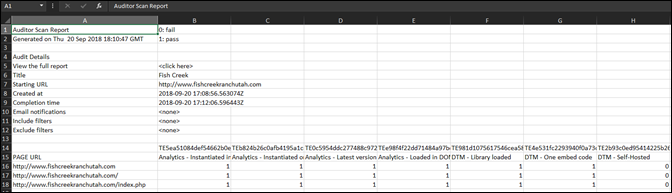

# Descargar informe {#download-report}

El informe muestra si cada dirección URL aprueba o suspende.

El informe se puede ver en la página Informe de valoración de la interfaz de usuario. También puede descargar el informe:

1. Desde una lista de Adobe Experience Platform Auditor o un informe de valoración, haga clic en **[!UICONTROL Descargar informe]**.

   Como hoja de cálculo o archivo PDF.
1. Especifique si desea abrir o guardar el archivo.

1. Haga clic en **[!UICONTROL Aceptar]**.

   La hoja de cálculo muestra si cada prueba ha superado o ha suspendido en cada una de las páginas.

   

El PDF incluye la siguiente información:

* Configuración de la auditoría
* Marca de hora de finalización
* Puntuación general
* Puntuación por categoría
* Pruebas unitarias aplicadas con direcciones URL con errores
* Enlace de recomendaciones y documentos de ayuda por prueba
