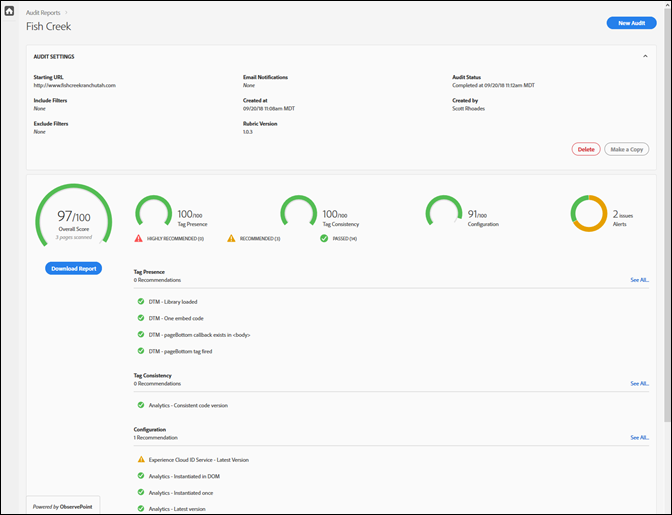
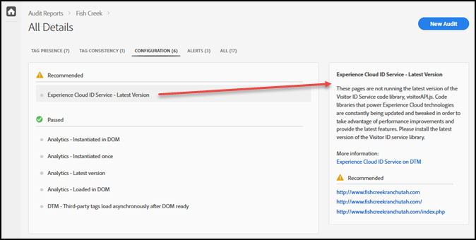

# Informe de valoración {#scorecard}

Después de realizar una prueba, el informe de valoración muestra información sobre la auditoría.

Haga clic en el nombre de la auditoría en la página Auditor de Adobe Experience Platform para vista de los resultados de la prueba.

Utilice el informe de valoración para ver los resultados de la auditoría en las siguientes categorías:

* Puntuación general
* Presencia de etiquetas

   Se evalúa si la etiqueta existe y si está en el lugar correcto en el código de página.
* Coherencia de etiquetas

   Se comprueba si las etiquetas son coherentes en todas las direcciones URL.
* Configuración

   Comprobación de las etiquetas con relación a otras normas y prácticas recomendadas.
* Alerta

   Las alertas muestran los problemas que deben tenerse en cuenta, aunque eso no afecta a la puntuación.

La puntuación depende de la ponderación de cada prueba y de si se supera o no. Si se supera, la puntuación aumenta según el número de puntos conforme a la ponderación de la prueba.

* 0: Advierte de problemas que debe tener en cuenta pero que no afectan a la puntuación.
* 1: Recomienda una optimización. No afecta a la precisión de los datos.
* 2: Si no realiza esta prueba, no tendrá acceso a las últimas funciones y correcciones de Adobe Experience Cloud.
* 3: Comprueba la eficacia y si la implementación cumple las prácticas recomendadas.
* 4: En caso de error, es posible que esté recopilando datos poco fiables.
* 5: Error en el que se podrían perder datos.

El informe de valoración especifica los problemas de nivel 4 o 5 como correcciones **necesarias**.

El informe de valoración especifica los problemas de nivel 1 a 3 como correcciones **recomendadas**.

Haga clic en **[!UICONTROL Descargar el informe]** para descargar un archivo o PDF con la información obtenida en la auditoría.[!DNL Excel]

Además de la puntuación de cada categoría, el informe de valoración especifica las correcciones recomendadas o necesarias, así como los elementos que han superado la prueba. En el cuadro de la derecha, haga clic en cada número para ver más detalles. Vuelva a hacer clic para estudiarlo en profundidad y ver las recomendaciones para solucionar el problema. A continuación, se muestran los detalles de un problema de Solución recomendada en el informe de valoración anterior:

Para ver los problemas detectados en cada categoría, haga clic en las categorías de la parte superior de la pantalla.

## ¿Qué páginas formaban parte de la prueba? {#section-fd38ffeb868648e89c34c5772fa65f46}

Puede ver las listas de direcciones URL que han superado o suspendido la prueba.

From the scorecard, click a test name or the **[!UICONTROL See All]** link under each category heading. Muestra los detalles de las pruebas. En cada prueba puede ver la descripción de la misma y una lista de todas las direcciones URL que han aprobado o suspendido. Esta información también se incluye en los informes descargados.
